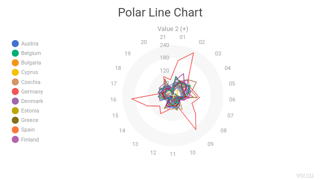

---
hide:
  - toc
---

# Static charts

[{ class='image-gallery' }](./NO_spiderweb_line_2dis_1con.md)
[{ class='image-gallery' }](./area_negative_1dis_1con.md)
[{ class='image-gallery' }](./bar_rectangle_negative_1dis_1con.md)
[{ class='image-gallery' }](./bubble_circle_1dis_2con.md)
[{ class='image-gallery' }](./bubble_circle_2dis_2con.md)
[{ class='image-gallery' }](./column_grouped_rectangle_negative_2dis_1con.md)
[{ class='image-gallery' }](./column_stacked_rectangle_1dis_1con.md)
[{ class='image-gallery' }](./column_stacked_rectangle_negative_2dis_1con.md)
[{ class='image-gallery' }](./coxcomb_stacked_rectangle_2dis_1con.md)
[{ class='image-gallery' }](./donut_rectangle_1dis_1con.md)
[{ class='image-gallery' }](./dotplot_circle_negative_1dis_1con.md)
[{ class='image-gallery' }](./histogram_rectangle_negative_1dis_1con.md)
[{ class='image-gallery' }](./line_negative_1dis_1con.md)
[{ class='image-gallery' }](./line_negative_2dis_1con.md)
[{ class='image-gallery' }](./marimekko_rectangle_2dis_2con.md)
[{ class='image-gallery' }](./mekko_rectangle_1dis_2con.md)
[{ class='image-gallery' }](./pie_rectangle_1dis_1con.md)
[{ class='image-gallery' }](./radial_rectangle_1dis_1con.md)
[{ class='image-gallery' }](./radial_stacked_rectangle_2dis_1con.md)
[{ class='image-gallery' }](./scatterplot_circle_negative_1dis_2con.md)
[{ class='image-gallery' }](./scatterplot_circle_negative_2dis_3con.md)
[{ class='image-gallery' }](./spiderweb_area_1dis_1con.md)
[{ class='image-gallery' }](./spiderweb_line_1dis_1con.md)
[{ class='image-gallery' }](./stacked_area_2dis_1con.md)
[{ class='image-gallery' }](./stacked_mekko_rectangle_2dis_2con.md)
[{ class='image-gallery' }](./stream_stacked_area_3dis_1con.md)
[{ class='image-gallery' }](./treemap_rectangle_1dis_1con.md)
[{ class='image-gallery' }](./treemap_rectangle_2dis_2con.md)
[{ class='image-gallery' }](./waterfall_rectangle_negative_1dis_1con.md)
